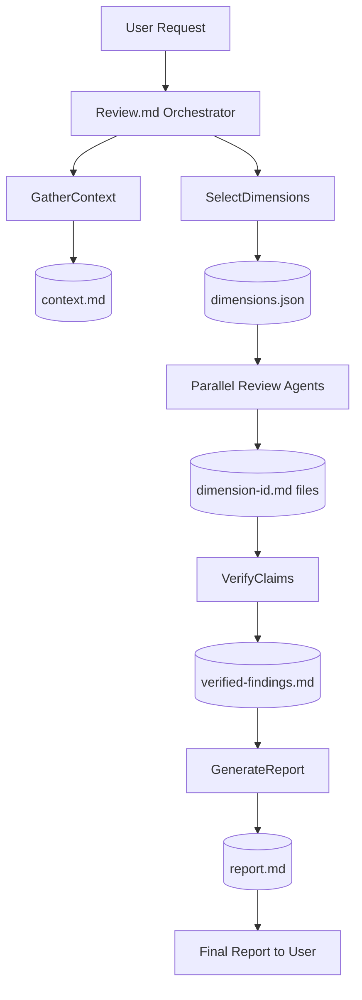
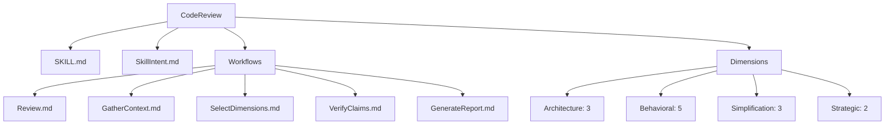

# Design Review Example - CodeReview Skill Structure

## Summary

- **Target:** `skills/CodeReview`
- **Overall Score:** `70/100`
- **Top Risk:** Internal stage contracts are spread across workflow prose and could drift.
- **Top Opportunity:** Add one canonical topology diagram to `CodeReview/SKILL.md` for faster onboarding.

## Scope

- **Included:**
  - `skills/CodeReview/SKILL.md`
  - `skills/CodeReview/SkillIntent.md`
  - `skills/CodeReview/Workflows/*.md`
  - `skills/CodeReview/Dimensions/**/*.md` (enumeration only)
- **Excluded:**
  - Any non-`CodeReview` skills
  - Runtime orchestration implementation outside `skills/CodeReview`

## Design Metadata Links

No external metadata links were required for this review; all critical context came from in-repo skill files.

## Critical Context Coverage

| Critical Item | Where Captured | Adequate for Decisions (Y/N) | Gap |
|---|---|---|---|
| Pipeline stage order and contracts | `Workflows/Review.md` + stage workflow files | Y | None |
| Dimension inventory and categorization | `Dimensions/**/*.md` + `SKILL.md` summary | Y | None |
| Credibility gate behavior | `Workflows/VerifyClaims.md` | Y | None |
| User-facing entry point and mode split | `SKILL.md` | Y | None |

## Structure Enumeration

### Routing and Entry Points

- User-facing workflow:
  - `Review -> Workflows/Review.md`
- Internal workflows (pipeline stages):
  - `GatherContext -> Workflows/GatherContext.md`
  - `SelectDimensions -> Workflows/SelectDimensions.md`
  - `VerifyClaims -> Workflows/VerifyClaims.md`
  - `GenerateReport -> Workflows/GenerateReport.md`

### Dimension Inventory

- `Architecture`: `A1`, `A2`, `A5`
- `Behavioral`: `B1`, `B2`, `B3`, `B4`, `B5`
- `Simplification`: `S1`, `S2`, `S4`
- `Strategic`: `D1`, `D3`

Total dimension files: `13`

### Artifact Contracts

| Stage | Input | Output |
|---|---|---|
| Setup | user request | `$REVIEW_DIR` |
| GatherContext | target + lenses | `context.md` |
| SelectDimensions | `context.md` + `Dimensions/` | `dimensions.json` |
| Review Agents (parallel) | selected dimensions + context | `dimension-[id].md` |
| VerifyClaims | per-dimension outputs + context | `verified-findings.md` |
| GenerateReport | verified findings + context | `report.md` |

## Visuals

### Execution Pipeline

Interpretation: The orchestration model is explicit, artifact-driven, and enforces stage boundaries with file existence checks.

### Static Structure Map

Interpretation: `SKILL.md` routes users into one orchestrator, while execution depth lives in `Workflows/` and review logic is distributed across 13 dimension files.

## Dimension Scores

| Dimension | Raw (0-2) | Weight | Weighted Score | Evidence | Recommendation |
|---|---:|---:|---:|---|---|
| D1 Audience, Readability, and Accessibility | 1 | 16 | 8 | Clear audience targeting, but long dense prose reduces readability | Add short executive summaries to internal workflows |
| D2 Scope and Boundaries | 2 | 14 | 14 | Pipeline contracts and stage checks are explicit | Keep |
| D3 Signal Density and Digestibility | 1 | 14 | 7 | Rich detail but very long sections | Add compact summary blocks at top of each workflow |
| D4 Decision Traceability and Tradeoffs | 2 | 14 | 14 | Rationale for process boundaries is explicit | Keep |
| D5 Workflow and Ownership Clarity | 2 | 12 | 12 | Orchestrator vs agent responsibilities are clear | Keep |
| D6 Verification and Credibility | 2 | 10 | 10 | Dedicated `VerifyClaims` stage with tallying | Keep |
| D7 Visual Expressiveness (Mermaid-First) | 0 | 10 | 0 | No built-in diagrams in CodeReview docs | Add topology and pipeline diagrams to SKILL.md |
| D8 Metadata Boundary and Link Hygiene | 1 | 10 | 5 | Artifact contracts are explicit, but there is no dedicated metadata-link policy | Add `Design Metadata Links` guidance in `CodeReview/SKILL.md` |

Total score: `70/100`

## Priority Findings

### Must Fix

1. Add canonical Mermaid topology in `CodeReview/SKILL.md`.
   - Owner: Skill maintainer
   - Change: `skills/CodeReview/SKILL.md`
   - Outcome: Faster comprehension of architecture and stage boundaries

### Should Fix

1. Add one-paragraph executive summaries to each internal workflow.
   - Owner: Skill maintainer
   - Change: `skills/CodeReview/Workflows/*.md`
   - Outcome: Better digestibility without losing detail

2. Add a compact "stage contract" table to `Review.md` and link to it from `SKILL.md`.
   - Owner: Skill maintainer
   - Change: `skills/CodeReview/Workflows/Review.md`, `skills/CodeReview/SKILL.md`
   - Outcome: Stronger single-source visibility for outputs and checks

### Optional

1. Add a dedicated `Topology.md` with expanded diagrams and examples.
   - Owner: Skill maintainer
   - Change: `skills/CodeReview/Topology.md`
   - Outcome: Better onboarding for new maintainers
