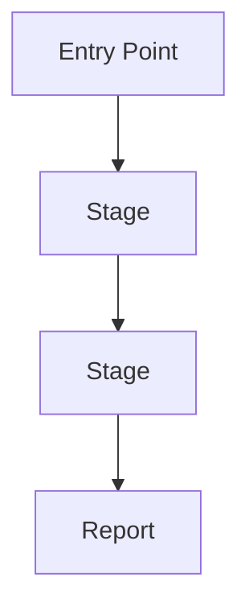
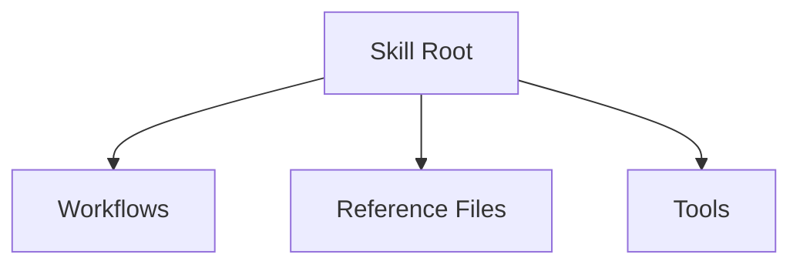

# Design Review Report Template

## 1. Summary

- **Target:** `[ArtifactName]`
- **Overall Score:** `[0-100]`
- **Top Risk:** `[one sentence]`
- **Top Opportunity:** `[one sentence]`

## 2. Scope

- **Included:** `[files/directories]`
- **Excluded:** `[files/directories]`
- **Review Mode:** `[structure-only | structure+content]`

## 3. Design Metadata Links

Use this section when external artifacts are part of the design context.

| Item | Type | Link | Why Linked (not embedded) | In-Design Summary Present |
|---|---|---|---|---|
| `[example: decision log]` | `[ticket | dashboard | transcript | spec]` | `[URL/path]` | `[reason]` | `[yes/no]` |

## 4. Critical Context Coverage

List critical information that must be known to implement or review safely.

| Critical Item | Where Captured | Adequate for Decisions (Y/N) | Gap |
|---|---|---|---|
| `[item]` | `[in design section or metadata link]` | `[Y/N]` | `[if any]` |

## 5. Structure Enumeration

### Routing and Entry Points

- User-facing workflows:
  - `[WorkflowName] -> [file path]`
- Internal workflows:
  - `[WorkflowName] -> [file path]`

### Artifact Contracts

| Stage | Input | Output |
|---|---|---|
| `[stage]` | `[artifact]` | `[artifact]` |

## 6. Visuals

### Execution Flow

Interpretation: `[1 short paragraph]`

### Structure Map

Interpretation: `[1 short paragraph]`

## 7. Dimension Scores

Include only dimensions that actually ran for this review.

| Dimension | Raw (0-2) | Weight | Weighted Score | Evidence | Recommendation |
|---|---:|---:|---:|---|---|
| `[DimensionName]` | | | | | |

## 8. Findings by Priority

### Must Fix

1. `[issue]`  
   - Owner: `[role]`  
   - Change: `[artifact]`  
   - Outcome: `[measurable result]`

### Should Fix

1. `[issue]`  
   - Owner: `[role]`  
   - Change: `[artifact]`  
   - Outcome: `[measurable result]`

### Optional

1. `[issue]`  
   - Owner: `[role]`  
   - Change: `[artifact]`  
   - Outcome: `[measurable result]`

## 9. Source Links

- `[Source title](URL)`
