# Obsidian Skill

**USE WHEN**: User mentions "obsidian", "my notes", "save this", "vault", or wants to capture/organize information.

---

## Vault Location

```
Path: C:\Users\fujos\Obsidian
Unix: /c/Users/fujos/Obsidian
```

**PAI has direct read/write access.**

---

## Obsidian Syntax

### Wiki Links
```markdown
[[Note Name]]                    # Link to note
[[Note Name|Display Text]]       # Link with alias
[[Note Name#Heading]]            # Link to heading
[[Note Name#^block-id]]          # Link to block
```

### Tags
```markdown
#topic                           # Inline tag
#topic/subtopic                  # Nested tag
tags: [topic1, topic2]           # Frontmatter tags
```

### Embeds (Transclusion)
```markdown
![[Note Name]]                   # Embed entire note
![[Note Name#Heading]]           # Embed specific section
![[Note Name#^block-id]]         # Embed specific block
![[image.png]]                   # Embed image
![[image.png|300]]               # Embed with width
![[image.png|300x200]]           # Embed with dimensions
![[file.pdf]]                    # Embed PDF (first page)
![[file.pdf#page=5]]             # Embed specific PDF page
```

### Block References
```markdown
This is a paragraph. ^my-block   # Create block ID (at end of line)
[[Note#^my-block]]               # Link to block
![[Note#^my-block]]              # Embed block
```

### Text Formatting
```markdown
**bold**                         # Bold text
*italic* or _italic_             # Italic text
~~strikethrough~~                # Strikethrough
==highlighted text==             # Highlight (yellow background)
`inline code`                    # Inline code
> blockquote                     # Blockquote
```

### Comments
```markdown
%%This is a comment%%            # Obsidian comment (hidden in preview)
<!-- HTML comment -->            # HTML comment (also hidden)
```

### HTML Support
Obsidian supports sanitized HTML:
```markdown
<sub>subscript</sub>             # Subscript text
<sup>superscript</sup>           # Superscript text
<mark>marked text</mark>         # Highlighted text
<u>underlined</u>                # Underlined text
<br>                             # Line break
```

### Math/LaTeX (KaTeX)
```markdown
Inline: $E = mc^2$

Display block:
$$
\int_{-\infty}^{\infty} e^{-x^2} dx = \sqrt{\pi}
$$

Common symbols:
$\alpha, \beta, \gamma$          # Greek letters
$\sum_{i=1}^{n} x_i$             # Summation
$\frac{a}{b}$                    # Fraction
$\sqrt{x}$                       # Square root
$x^2, x_n$                       # Superscript/subscript
$\pm, \times, \div, \neq$        # Operators
```

### Callouts
```markdown
> [!note] Title
> Content here

> [!tip] Pro Tip
> Helpful advice

> [!warning] Watch Out
> Important warning

> [!question] Open Question
> Something to explore

> [!info]- Collapsed by default
> Hidden content (note the minus sign)

> [!success]+ Expanded by default
> Visible content (note the plus sign)
```

**Available callout types**:
- **Information**: note, abstract, summary, info, tip, hint, important
- **Success**: success, check, done
- **Questions**: question, help, faq
- **Warnings**: warning, caution, attention
- **Errors**: failure, fail, missing, danger, error, bug
- **Other**: example, quote, cite

### Task Lists
```markdown
- [ ] Unchecked task
- [x] Completed task
- [/] In progress (Tasks plugin)
- [-] Cancelled (Tasks plugin)
```

### Footnotes
```markdown
Here's a statement[^1].
Another claim[^note].

[^1]: This is the footnote content.
[^note]: Footnotes can have any identifier.
```

---

## Properties (Frontmatter)

Properties are YAML metadata at the top of notes. Obsidian recognizes 6 property types:

### Property Types
```yaml
---
# Text - single value
title: My Note Title
author: Daniel Miessler

# List - multiple values
tags:
  - topic1
  - topic2
aliases:
  - alternate name
  - another alias

# Number - numeric value
rating: 8
priority: 1

# Checkbox - boolean
completed: true
published: false

# Date - YYYY-MM-DD
created: 2026-01-22
due: 2026-02-15

# Date & Time - ISO 8601
modified: 2026-01-22T14:30:00
---
```

### Special Properties
```yaml
---
aliases: [alt1, alt2]            # Alternative names for linking
cssclass: custom-class           # Apply custom CSS
publish: true                    # Obsidian Publish visibility
tags: [tag1, tag2]               # Note tags
---
```

### Properties Impact
- **Search**: Filter by `[property:value]`
- **Graph**: Color/filter by properties
- **Dataview**: Query by any property
- **Templates**: Auto-populate properties

---

## Canvas

Canvas is Obsidian's infinite whiteboard for visual thinking.

### What Canvas Is
- Infinite spatial canvas for arranging notes, images, and ideas
- Non-linear thinking space alongside linear notes
- Visual project planning and relationship mapping
- Uses open `.canvas` format (JSON)

### Node Types
| Type | Description | Syntax |
|------|-------------|--------|
| Text | Standalone text card | Click canvas, type |
| Note | Embedded vault note | Drag note to canvas |
| File | Image, PDF, audio, video | Drag file to canvas |
| Link | Web page embed | Paste URL |
| Group | Container for nodes | Draw rectangle around nodes |

### When to Use Canvas
- **Mind mapping**: Visual brainstorming
- **Project overview**: See all pieces at once
- **Relationship mapping**: Connect disparate concepts
- **Mood boards**: Visual collections
- **Presentation planning**: Spatial storyboarding

### JSON Canvas Format
```json
{
  "nodes": [
    {"id": "1", "type": "text", "x": 0, "y": 0, "width": 250, "height": 100, "text": "Content"}
  ],
  "edges": [
    {"id": "e1", "fromNode": "1", "toNode": "2"}
  ]
}
```

---

## Mermaid Diagrams

Obsidian renders Mermaid natively in fenced code blocks. The syntax is:
````markdown
```mermaid
[diagram type]
    [content]
```
````

### Flow & Process Diagrams

#### Flowchart
````markdown
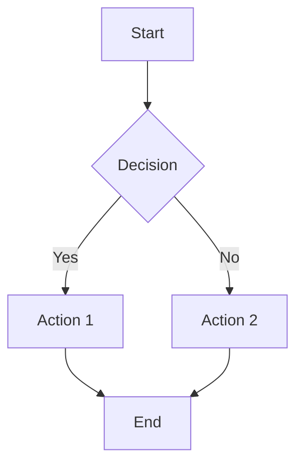
````

**Directions**: `TD` (top-down), `LR` (left-right), `BT` (bottom-top), `RL` (right-left)

**Node Shapes**:
```
[Square]       (Round)        {Diamond}
[[Subroutine]] [(Cylinder)]   ((Circle))
>Asymmetric]   {{{Hexagon}}}  [/Parallelogram/]
[\Trapezoid\]
```

#### Sequence Diagram
````markdown
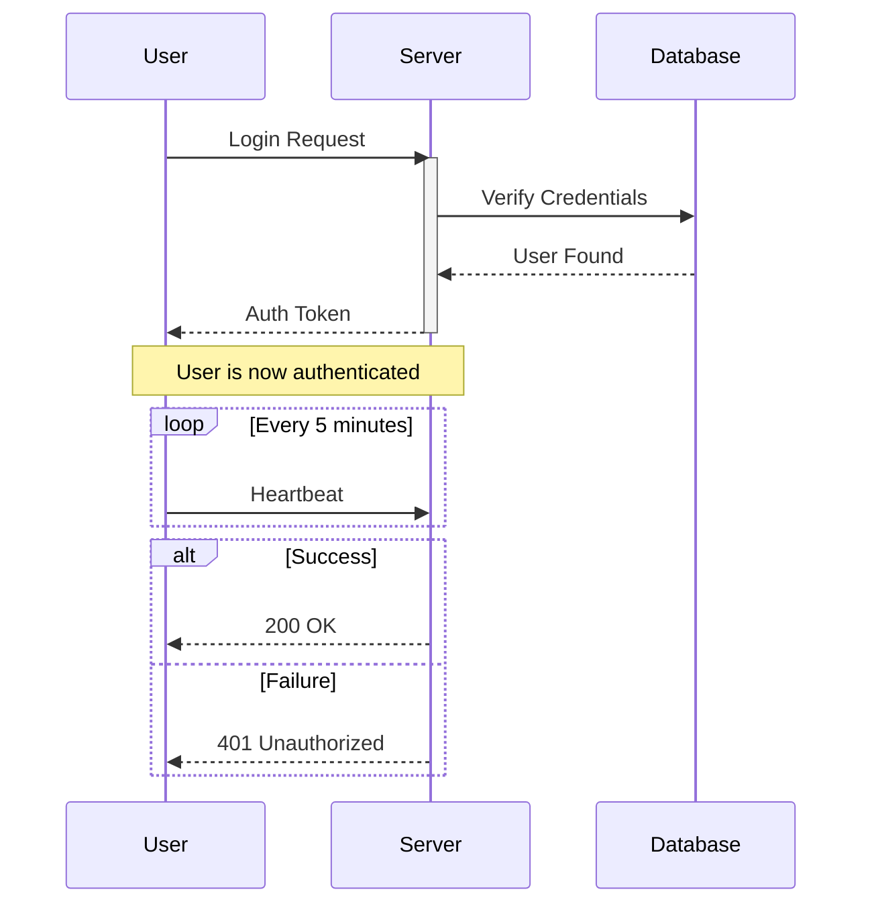
````

**Arrow Types**: `->>` (solid), `-->>` (dotted), `-x` (cross), `-)` (async)

#### State Diagram
````markdown
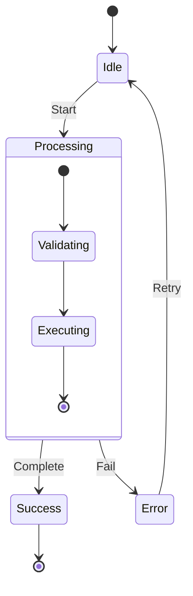
````

#### User Journey
````markdown
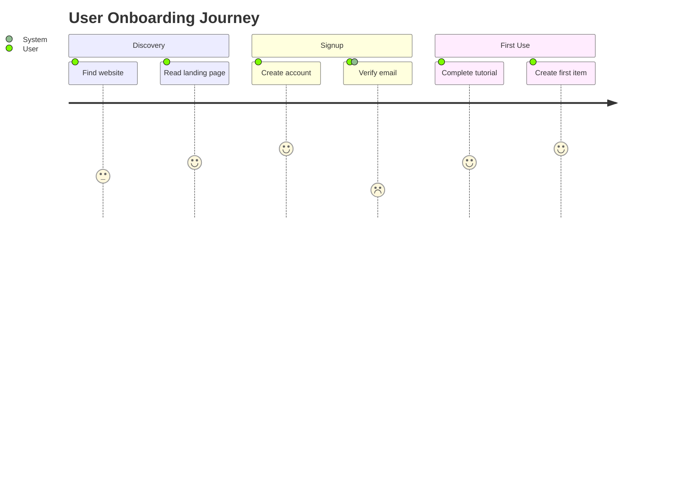
````

### Data & Metrics Diagrams

#### Pie Chart
````markdown
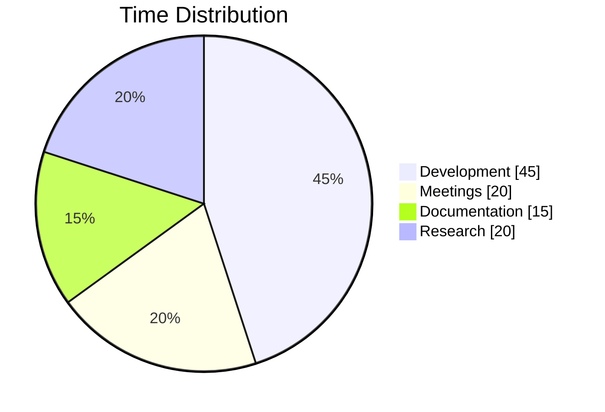
````

#### XY Chart
````markdown
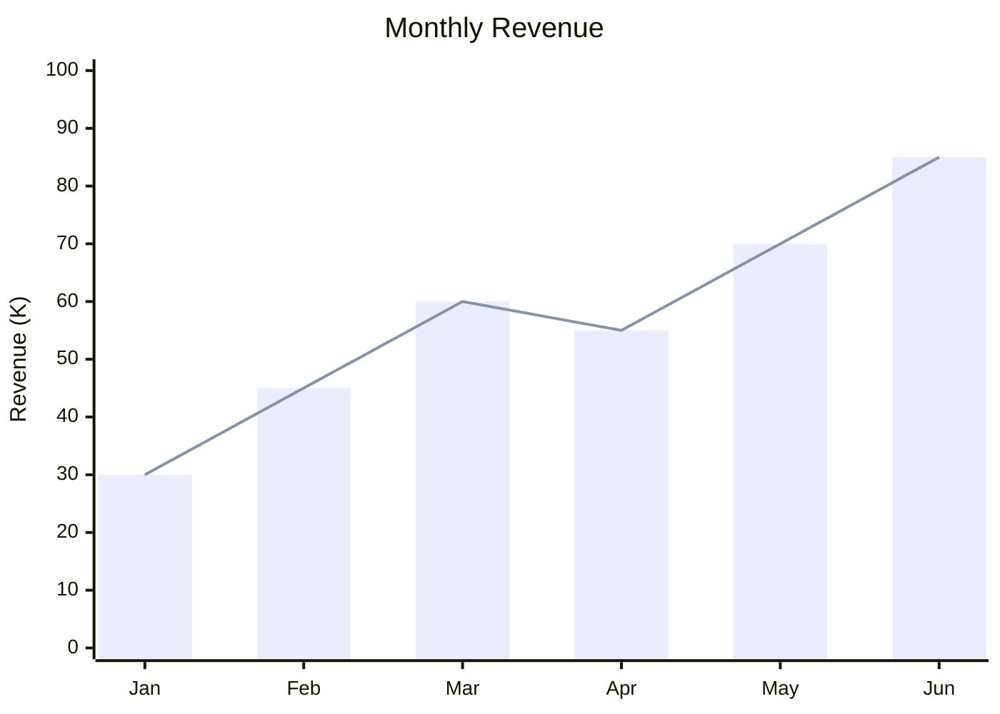
````

#### Quadrant Chart
````markdown
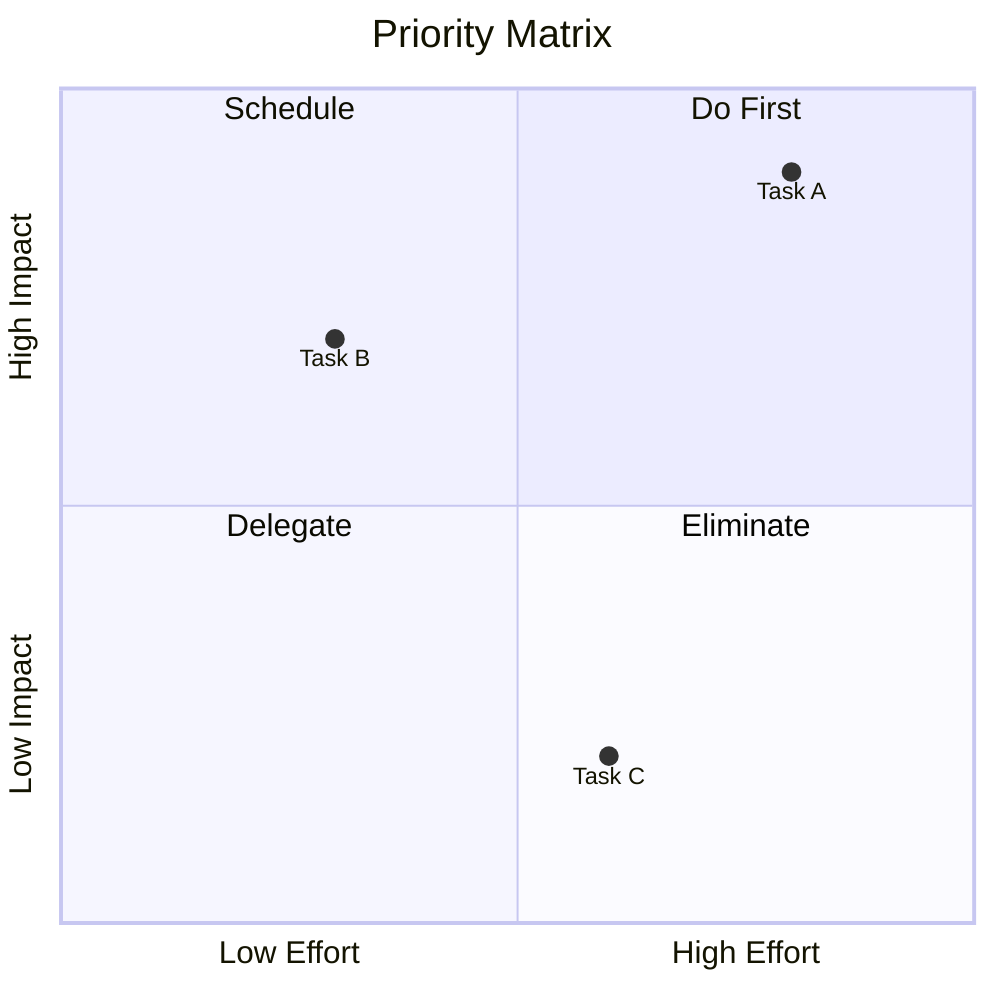
````

#### Sankey Diagram
````markdown
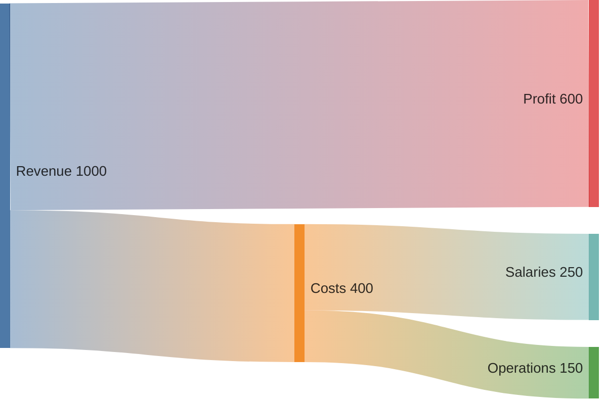
````

### Architecture & Design Diagrams

#### Class Diagram
````markdown
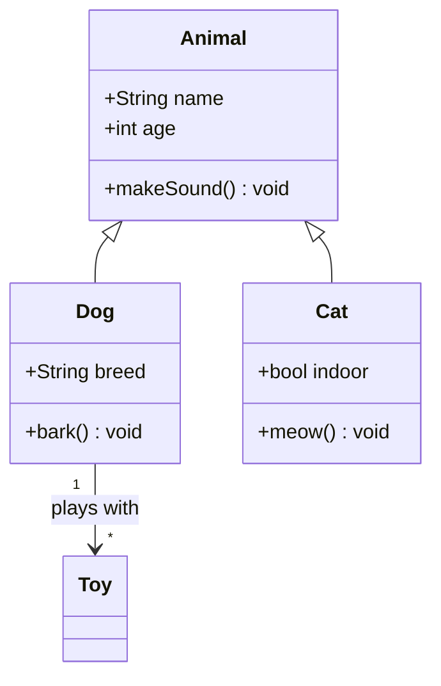
````

**Relationships**: `<|--` (inheritance), `*--` (composition), `o--` (aggregation), `-->` (association), `..>` (dependency)

#### Entity-Relationship Diagram
````markdown
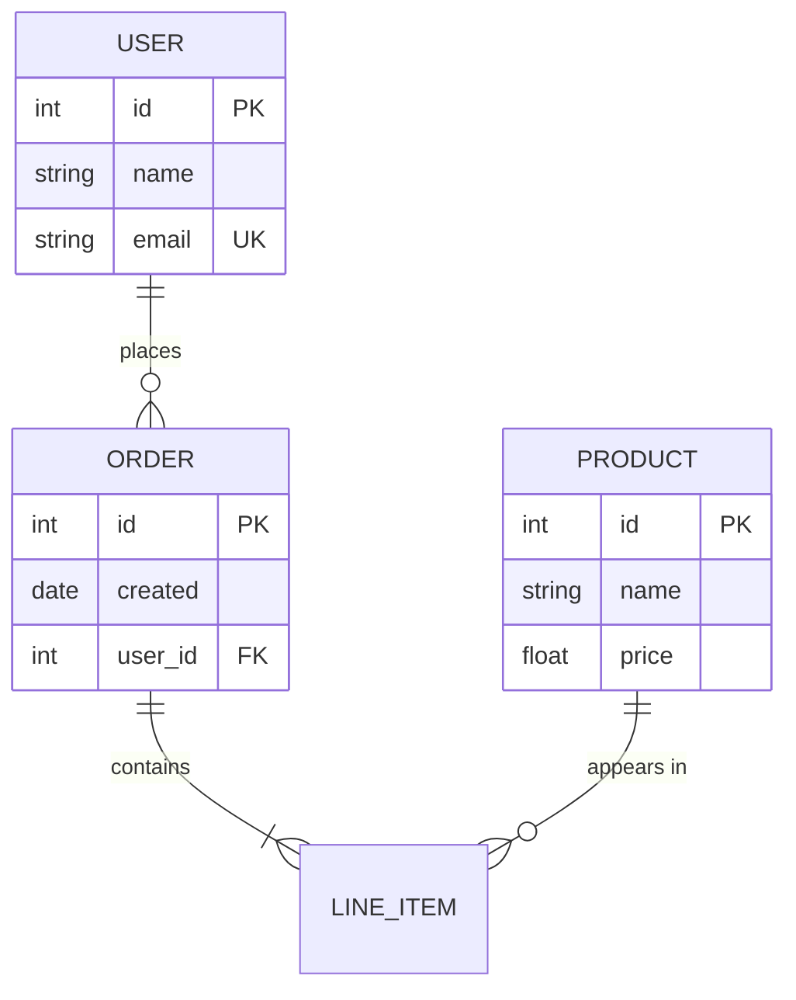
````

**Cardinality**: `||` (exactly one), `o|` (zero or one), `}|` (one or more), `}o` (zero or more)

#### C4 Context Diagram
````markdown
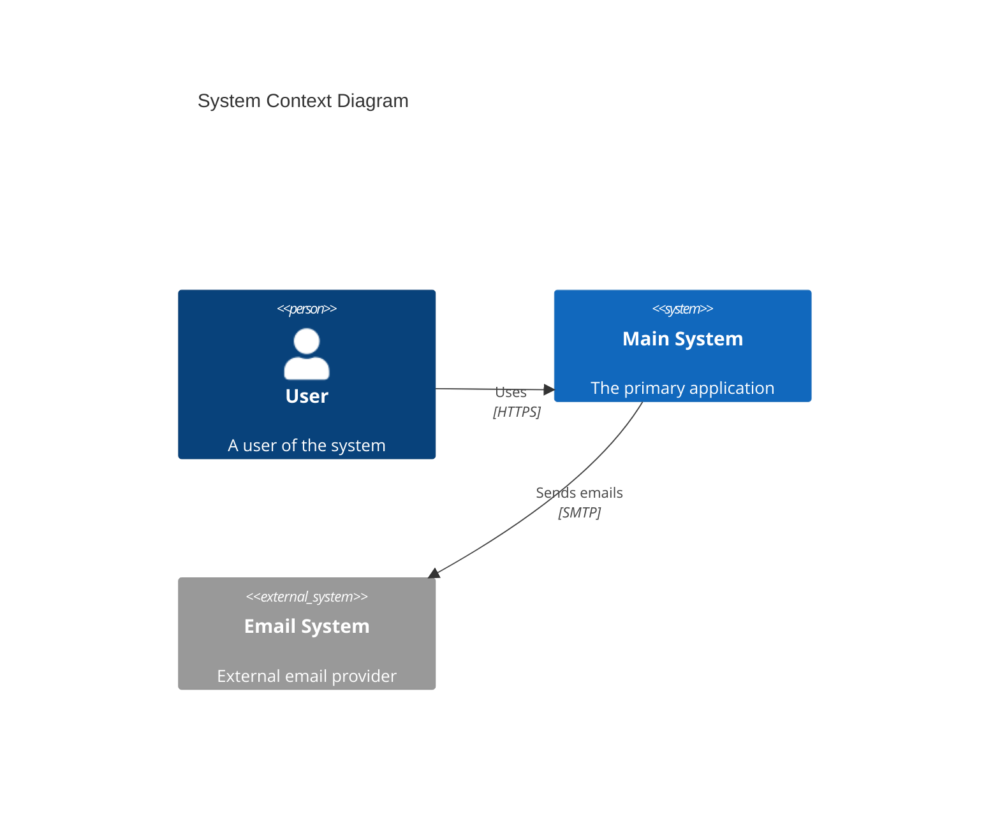
````

#### Block Diagram
````markdown
```mermaid
block-beta
    columns 3

    Frontend:3
    block:backend:2
        API
        DB[(Database)]
    end
    Cache

    Frontend --> API
    API --> DB
    API --> Cache
```
````

### Planning & Organization Diagrams

#### Gantt Chart
````markdown
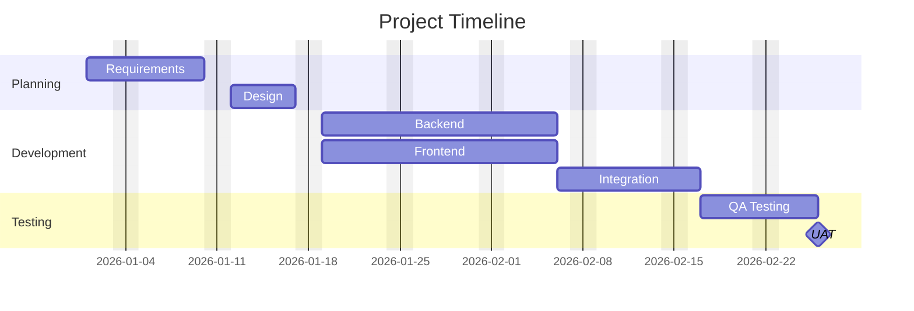
````

#### Timeline
````markdown
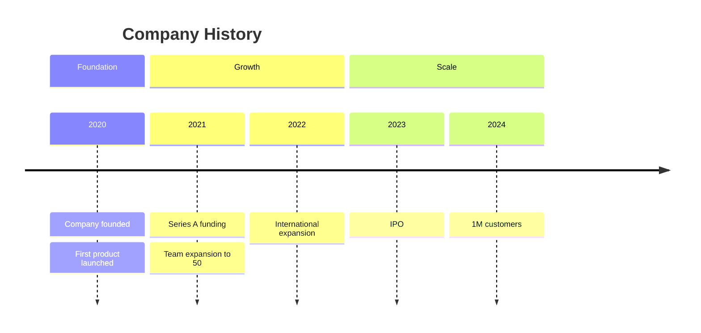
````

#### Mindmap
````markdown
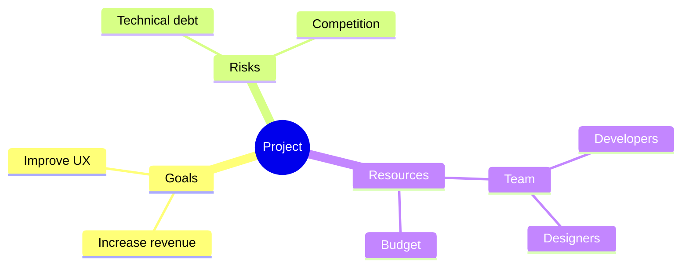
````

#### Git Graph
````markdown
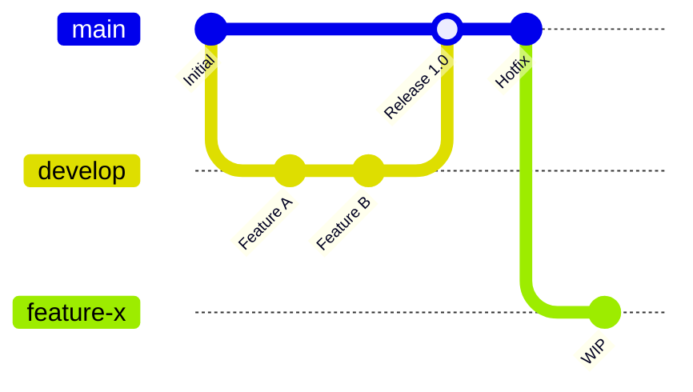
````

### Mermaid Styling & Theming

#### Built-in Themes
```mermaid
%%{init: {'theme': 'dark'}}%%
```
Available: `default`, `dark`, `forest`, `neutral`, `base`

#### Custom Styling with classDef
````markdown
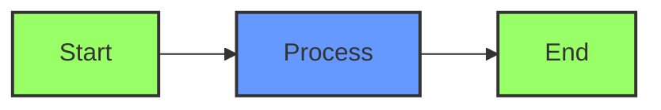
````

#### Inline Styling
````markdown
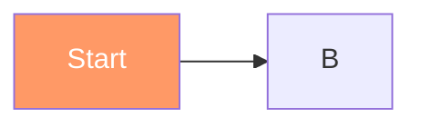
````

### Diagram Selection Guide

| Diagram | Best For |
|---------|----------|
| **Flowchart** | Decisions, processes, workflows, algorithms |
| **Sequence** | API calls, interactions, protocols |
| **State** | Lifecycles, status transitions |
| **User Journey** | UX flows, customer experience |
| **Pie** | Proportions, distributions |
| **XY Chart** | Trends, comparisons over time |
| **Quadrant** | Priority matrices, 2x2 analysis |
| **Sankey** | Flow quantities, resource distribution |
| **Class** | Object-oriented design, data models |
| **ER** | Database schemas, relationships |
| **C4** | System architecture, contexts |
| **Block** | Component layouts, infrastructure |
| **Gantt** | Project schedules, timelines |
| **Timeline** | History, milestones, events |
| **Mindmap** | Brainstorming, topic exploration |
| **Git** | Branch strategies, version history |

---

## Dataview Plugin

Dataview turns your vault into a queryable database.

### Query Types
```markdown
```dataview
TABLE file.name, rating, tags
FROM "Books"
WHERE rating >= 4
SORT rating DESC
LIMIT 10
```
```

```markdown
```dataview
LIST
FROM #project AND -#archived
SORT file.mtime DESC
```
```

```markdown
```dataview
TASK
FROM "Projects"
WHERE !completed
GROUP BY file.link
```
```

```markdown
```dataview
CALENDAR file.ctime
FROM "Daily Notes"
```
```

### Inline Queries
```markdown
Today is `= date(today)`.
This note has `= length(file.inlinks)` backlinks.
Last modified: `= this.file.mtime`.
```

### Common Query Patterns
```markdown
# Recent notes
```dataview
TABLE file.mtime as Modified
FROM ""
SORT file.mtime DESC
LIMIT 10
```

# Notes without tags
```dataview
LIST
FROM ""
WHERE length(file.tags) = 0
```

# Tasks due this week
```dataview
TASK
FROM ""
WHERE due >= date(today) AND due <= date(today) + dur(7 days)
SORT due ASC
```
```

### DataviewJS
For complex queries, use JavaScript:
```markdown
```dataviewjs
const pages = dv.pages("#project")
    .where(p => p.status === "active")
    .sort(p => p.priority, "desc");

dv.table(
    ["Project", "Priority", "Due"],
    pages.map(p => [p.file.link, p.priority, p.due])
);
```
```

---

## Templater Plugin

Templater enables dynamic templates with JavaScript execution.

### Basic Syntax
```markdown
<% tp.date.now("YYYY-MM-DD") %>         # Current date
<% tp.file.title %>                      # Current file name
<% tp.file.cursor() %>                   # Place cursor here
```

### tp Object Reference

| Object | Purpose | Example |
|--------|---------|---------|
| `tp.date` | Date operations | `tp.date.now("YYYY-MM-DD")` |
| `tp.file` | File operations | `tp.file.title`, `tp.file.rename()` |
| `tp.system` | System functions | `tp.system.prompt("Question?")` |
| `tp.user` | User functions | `tp.user.myFunction()` |
| `tp.web` | Web requests | `tp.web.random_picture()` |

### Template Examples

#### Daily Note Template
```markdown
---
created: <% tp.date.now("YYYY-MM-DD") %>
tags: [daily]
---

# <% tp.date.now("dddd, MMMM D, YYYY") %>

## Morning
- [ ]

## Tasks
- [ ]

## Notes


## Evening Reflection

```

#### Meeting Note Template
```markdown
---
created: <% tp.date.now("YYYY-MM-DDTHH:mm") %>
type: meeting
attendees:
tags: [meeting]
---

# Meeting: <% tp.system.prompt("Meeting topic?") %>

**Date**: <% tp.date.now("YYYY-MM-DD HH:mm") %>
**Attendees**:

## Agenda
1.

## Discussion


## Action Items
- [ ]

## Next Steps

```

### User Functions
Create reusable functions in `Scripts/` folder:
```javascript
// Scripts/greeting.js
function greeting(name) {
    return `Hello, ${name}!`;
}
module.exports = greeting;
```

Use in templates:
```markdown
<% tp.user.greeting("Daniel") %>
```

---

## Workflow Patterns

### Zettelkasten Method
**Philosophy**: Atomic, interconnected notes that grow organically.

**Structure**:
```
- Permanent notes: One idea per note, fully explained
- Literature notes: Summaries of sources
- Fleeting notes: Quick captures, process later
- MOCs: Maps of Content (hub notes)
```

**Naming**: Use timestamps or unique IDs: `202601221430 Concept Name`

**Key Practice**: Every note should link to at least one other note.

### PARA Method
**Philosophy**: Organize by actionability, not category.

```
📁 1-Projects/     # Active projects with deadlines
📁 2-Areas/        # Ongoing responsibilities
📁 3-Resources/    # Reference material by topic
📁 4-Archives/     # Inactive items from above
```

**Key Practice**: Move items between folders as status changes.

### GTD (Getting Things Done)
**In Obsidian**:
```markdown
Tags:
#inbox          # Unprocessed items
#next           # Next actions
#wait           # Waiting for someone
#someday        # Maybe later
#project        # Multi-step outcomes
```

**Daily Review**:
1. Process `#inbox` items
2. Review `#next` for today's work
3. Check `#wait` for follow-ups

### Daily Notes Workflow
**Structure**:
```markdown
# 2026-01-22

## Plan
- [ ] Top 3 priorities

## Log
- 09:00 - Started [[Project X]]
- 14:00 - Meeting with [[John Smith]]

## Notes
- Insight from today...

## Review
- What went well?
- What to improve?
```

**Linking**: Link to projects, people, and concepts mentioned.

### Research/Academic Workflow
**Structure**:
```
📁 Sources/        # PDFs and annotations
📁 Literature/     # Literature notes
📁 Concepts/       # Atomic concept notes
📁 Projects/       # Papers, theses
```

**Literature Note Template**:
```markdown
---
source: "[[Source Title]]"
authors:
year:
tags: [literature]
---

# Summary


# Key Points
-

# Quotes
> "Quote" (p. X)

# My Thoughts

```

### MOCs (Maps of Content)
Hub notes that organize a topic:
```markdown
# Programming MOC

## Core Concepts
- [[Variables]]
- [[Functions]]
- [[Data Structures]]

## Languages
- [[Python]]
- [[JavaScript]]
- [[Rust]]

## Practices
- [[Clean Code]]
- [[Testing]]
- [[Documentation]]
```

---

## Excalidraw

Excalidraw is a whiteboard plugin for hand-drawn diagrams.

### Key Features
- **Freehand drawing**: Sketch-style diagrams
- **LaTeX support**: Embed math formulas
- **SVG/PNG export**: High-quality exports
- **Obsidian integration**: Embed in notes with `![[drawing.excalidraw]]`
- **Collaborative**: Share drawings
- **OCR**: Text recognition (optional)

### When to Use Excalidraw vs Mermaid
| Use Excalidraw | Use Mermaid |
|----------------|-------------|
| Freeform sketches | Structured diagrams |
| Visual brainstorming | Code documentation |
| Architecture drawings | Automated generation |
| Custom visual styles | Version-controlled diagrams |

### Automate API
Excalidraw includes a scripting API for automation:
```javascript
// Access via ExcalidrawAutomate
ea.addText(0, 0, "Hello");
ea.addRect(0, 50, 100, 50);
ea.create();
```

### Linter Compatibility
Add to note frontmatter to exclude from Obsidian Linter:
```yaml
---
excalidraw-plugin: parsed
---
```

---

## Core Plugins (Built-in)

| Plugin | Purpose |
|--------|---------|
| Backlinks | See what links to current note |
| Graph View | Visualize connections |
| Quick Switcher | Ctrl+O to jump to any note |
| Templates | Insert template content |
| Daily Notes | Auto-create daily journal |
| Outline | Table of contents for current note |
| Word Count | Show word/character count |
| File Recovery | Snapshots for recovery |
| Canvas | Infinite whiteboard |
| Properties View | Edit frontmatter visually |

---

## Popular Community Plugins

| Plugin | Purpose |
|--------|---------|
| Dataview | Query notes like a database |
| Templater | Advanced templates with logic |
| Calendar | Visual calendar for daily notes |
| Tasks | Advanced task management |
| Excalidraw | Hand-drawn diagrams |
| Kanban | Kanban boards in markdown |
| Periodic Notes | Weekly/monthly notes |
| Obsidian Git | Automatic git backup |
| QuickAdd | Rapid capture and macros |
| Various Complements | Autocomplete suggestions |

---

## Keyboard Shortcuts

| Action | Shortcut |
|--------|----------|
| Quick Switcher | Ctrl+O |
| Command Palette | Ctrl+P |
| Search in Files | Ctrl+Shift+F |
| New Note | Ctrl+N |
| Toggle Edit/Preview | Ctrl+E |
| Bold | Ctrl+B |
| Italic | Ctrl+I |
| Link | Ctrl+K |
| Toggle Checkbox | Ctrl+Enter |
| Open Graph View | Ctrl+G |
| Open Backlinks | Alt+Enter |
| Split Vertically | Ctrl+\ |

---

## Quick Reference

```
VAULT:      C:\Users\fujos\Obsidian

LINKS:      [[Note]] | [[Note|Alias]] | [[Note#Heading]] | [[Note#^block]]
EMBEDS:     ![[Note]] | ![[image.png|300]] | ![[Note#^block]]
TAGS:       #tag | #parent/child | tags: [a, b]
CALLOUT:    > [!type] Title
DIAGRAM:    ```mermaid ... ```
TASK:       - [ ] unchecked | - [x] done
HIGHLIGHT:  ==text==
COMMENT:    %%hidden%% | <!-- hidden -->
MATH:       $inline$ | $$display$$
BLOCK ID:   Text ^my-id

PROPERTIES: text | list | number | checkbox | date | datetime

DATAVIEW:   TABLE/LIST/TASK/CALENDAR ... FROM ... WHERE ... SORT ...
TEMPLATER:  <% tp.date.now() %> | <% tp.file.title %>

DIAGRAMS:   flowchart | sequence | state | journey | pie | xychart
            quadrant | sankey | class | erDiagram | C4Context | block
            gantt | timeline | mindmap | gitGraph
```
