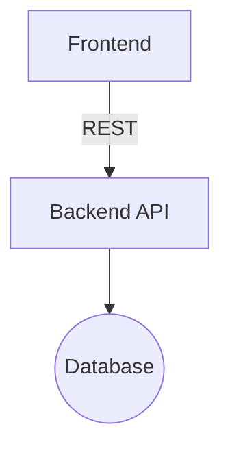
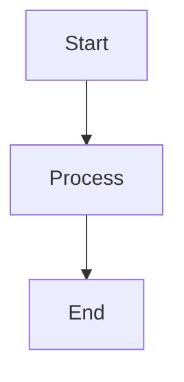
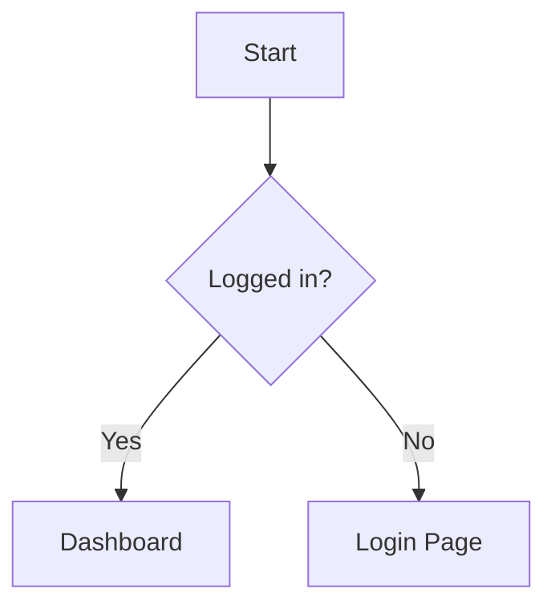
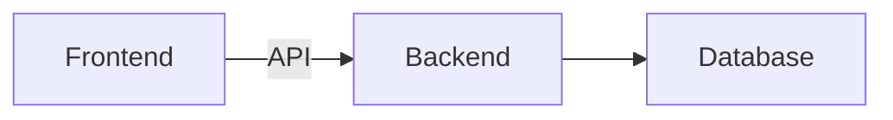

# ExcalidrawToMermaid Workflow

> **Trigger:** "convert to mermaid", "make this code-based", "excalidraw to mermaid"

## Purpose

Convert Excalidraw diagrams to Mermaid code for version control and text-based editing.

## Steps

### Step 1: Load Excalidraw File

Read the `.excalidraw` file from vault:

```bash
# Parse file path from user request or ask
FILE_PATH="C:\Users\fujos\Obsidian\Diagrams\[name].excalidraw"

# Read and parse JSON
# Extract: elements array, diagram structure
```

Expected structure:
```json
{
  "type": "excalidraw",
  "version": 2,
  "elements": [
    {
      "id": "element-1",
      "type": "rectangle",
      "x": 100,
      "y": 100,
      "text": "Component A",
      ...
    },
    {
      "id": "element-2",
      "type": "arrow",
      "startBinding": {"elementId": "element-1"},
      "endBinding": {"elementId": "element-3"},
      ...
    }
  ]
}
```

### Step 2: Analyze Diagram Structure

Identify diagram type and element relationships:

#### Detect Diagram Type
```javascript
function detectDiagramType(elements) {
  const hasDecisions = elements.some(e => e.type === "diamond");
  const hasSequence = detectSequentialPattern(elements);
  const hasHierarchy = detectHierarchicalPattern(elements);

  if (hasDecisions) return "flowchart";
  if (hasSequence) return "sequence" || "flowchart";
  if (hasHierarchy) return "mindmap" || "graph";

  return "flowchart";  // Default
}
```

#### Build Element Relationships
```javascript
// Map element IDs to labels
const nodeMap = new Map();
elements.forEach(el => {
  if (el.type !== "arrow" && el.type !== "line") {
    const label = el.text || `Node${nodeMap.size + 1}`;
    const id = `N${nodeMap.size + 1}`;
    nodeMap.set(el.id, {id, label, type: el.type});
  }
});

// Extract connections
const connections = elements
  .filter(el => el.type === "arrow")
  .map(arrow => ({
    from: arrow.startBinding?.elementId,
    to: arrow.endBinding?.elementId,
    label: arrow.text || ""
  }));
```

### Step 3: Map to Mermaid Syntax

Convert elements to Mermaid code based on type:

#### Flowchart Conversion
```javascript
function toMermaidFlowchart(elements) {
  let mermaid = "```mermaid\nflowchart TD\n";

  // Add nodes
  elements.forEach((el, id) => {
    const {id: nodeId, label, type} = el;

    if (type === "rectangle") {
      mermaid += `    ${nodeId}[${label}]\n`;
    } else if (type === "ellipse") {
      mermaid += `    ${nodeId}((${label}))\n`;
    } else if (type === "diamond") {
      mermaid += `    ${nodeId}{${label}}\n`;
    }
  });

  // Add connections
  connections.forEach(conn => {
    const from = nodeMap.get(conn.from)?.id;
    const to = nodeMap.get(conn.to)?.id;
    const label = conn.label ? `|${conn.label}|` : "";

    if (from && to) {
      mermaid += `    ${from} -->${label} ${to}\n`;
    }
  });

  mermaid += "```";
  return mermaid;
}
```

**Excalidraw → Mermaid Shape Mapping:**

| Excalidraw Type | Mermaid Syntax | Use Case |
|-----------------|----------------|----------|
| `rectangle` | `A[Label]` | Process/component |
| `ellipse` | `A((Label))` | Start/end/concept |
| `diamond` | `A{Label}` | Decision point |
| `arrow` | `A --> B` | Connection |
| `arrow` (labeled) | `A -->|text| B` | Labeled connection |

#### Mind Map Conversion
```javascript
function toMermaidMindmap(elements) {
  // Find central node (usually largest or most connected)
  const central = findCentralNode(elements);

  let mermaid = "```mermaid\nmindmap\n";
  mermaid += `  root((${central.label}))\n`;

  // Add branches (connected to central)
  getBranches(central).forEach(branch => {
    mermaid += `    ${branch.label}\n`;

    // Add sub-branches
    getSubBranches(branch).forEach(sub => {
      mermaid += `      ${sub.label}\n`;
    });
  });

  mermaid += "```";
  return mermaid;
}
```

#### Simple Graph Conversion
```javascript
function toMermaidGraph(elements) {
  let mermaid = "```mermaid\ngraph LR\n";

  // Add all nodes and connections
  elements.forEach((el, id) => {
    const {id: nodeId, label} = el;
    mermaid += `    ${nodeId}[${label}]\n`;
  });

  connections.forEach(conn => {
    const from = nodeMap.get(conn.from)?.id;
    const to = nodeMap.get(conn.to)?.id;
    if (from && to) {
      mermaid += `    ${from} --> ${to}\n`;
    }
  });

  mermaid += "```";
  return mermaid;
}
```

### Step 4: Handle Limitations

Document what **cannot** be converted:

| Excalidraw Feature | Mermaid Support | Workaround |
|--------------------|-----------------|------------|
| **Custom positioning** | ❌ Auto-layout only | Accept Mermaid layout |
| **Hand-drawn style** | ❌ Clean lines only | Lose aesthetic |
| **Freeform freedraw** | ❌ No equivalent | Convert to text annotations |
| **Images** | ❌ Not supported | Remove or reference externally |
| **LaTeX formulas** | ⚠️ Limited support | Convert to text or keep separate |
| **Custom colors** | ⚠️ Theme-based | Use classDef for some styling |
| **Frames** | ❌ Not supported | Split into separate diagrams |

**User notification:**
```
⚠️ CONVERSION LIMITATIONS:
- Custom positioning will be lost (Mermaid uses auto-layout)
- Hand-drawn aesthetic will become clean lines
- Freeform elements (freedraw) cannot be converted
- Images and frames are not supported in Mermaid
```

### Step 5: Generate Mermaid Code

Create complete Mermaid code block:

```markdown
# [Original Diagram Name] (Mermaid Version)

Converted from: [[original.excalidraw]]



**Original:** [[original.excalidraw]]
**Conversion Date:** 2026-01-25
**Limitations:** Custom positioning lost, auto-layout applied
```

### Step 6: Save or Replace

**Option A: Create New Mermaid Note**
```bash
# Save as new markdown file
FILE_NAME="[original-name]-mermaid.md"
SAVE_PATH="C:\Users\fujos\Obsidian\Diagrams\$FILE_NAME"
```

**Option B: Replace Excalidraw Embed**
```bash
# Find notes embedding the Excalidraw file
# Replace: ![[diagram.excalidraw]]
# With:    [mermaid code block]
```

**Option C: Side-by-Side**
```markdown
# Comparison: Excalidraw vs Mermaid

## Excalidraw (Original)
![[diagram.excalidraw]]

## Mermaid (Converted)
```mermaid
[generated code]
```
```

### Step 7: Confirm and Report

Return conversion summary:
```
CONVERTED: SystemArchitecture.excalidraw → SystemArchitecture-mermaid.md
DIAGRAM TYPE: Flowchart
ELEMENTS: 5 nodes, 4 connections
SAVED: Diagrams/SystemArchitecture-mermaid.md

⚠️ NOTES:
- Custom positioning was reset to Mermaid auto-layout
- Hand-drawn style converted to clean lines
- 2 freedraw elements could not be converted (removed)
```

## Example Outputs

### Example 1: Simple Flowchart
```
Input: Excalidraw with 3 rectangles and 2 arrows

Output:


SAVED: LoginFlow-mermaid.md
ELEMENTS: 3 nodes, 2 connections
```

### Example 2: Decision Flow
```
Input: Excalidraw with decision diamond

Output:


SAVED: AuthFlow-mermaid.md
ELEMENTS: 4 nodes (1 decision), 4 connections
```

### Example 3: Architecture with Lost Details
```
Input: Excalidraw with custom colors, images, and precise positioning

Output:


SAVED: Architecture-mermaid.md
ELEMENTS: 3 nodes, 2 connections

⚠️ LOST IN CONVERSION:
- Custom colors (now uses default theme)
- Logo images (removed)
- Precise horizontal alignment (now auto-layout)
```

## Reverse Conversion (Mermaid → Excalidraw)

**Note:** This workflow is one-way (Excalidraw → Mermaid). Reverse conversion is possible but requires:
- Parsing Mermaid syntax
- Generating Excalidraw JSON
- Auto-layout algorithm for positioning

For reverse conversion, use the **CreateExcalidrawDiagram** workflow with Mermaid code as input description.

## Best Practices

1. **Review before converting** - Check if Mermaid supports the diagram type
2. **Save original** - Keep Excalidraw file, create new Mermaid file
3. **Document limitations** - Note what was lost in conversion
4. **Use for version control** - Mermaid is git-friendly, Excalidraw less so
5. **Hybrid approach** - Sketches in Excalidraw, final docs in Mermaid
6. **Test conversion** - Verify Mermaid renders correctly before deleting original

## When NOT to Convert

**Keep Excalidraw if:**
- Custom visual styling is critical
- Hand-drawn aesthetic is desired
- Precise positioning matters
- Includes images, frames, or freeform elements
- Used for presentations (frames)

**Convert to Mermaid if:**
- Need version control in markdown
- Diagram is simple and structured
- Auto-layout is acceptable
- Want text-based editing
- Need reproducible diagrams

